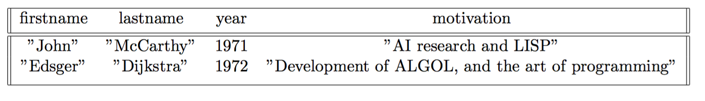
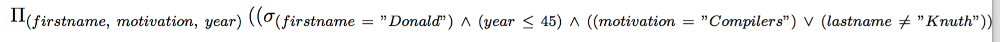
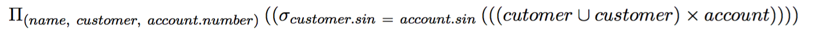

# Coddie: An Interpreter for Extended Relational Algebra

Inspired by the simplicity and elegance of both the Scheme programming language, and the relational algebra formal system, Coddie is an interpreter with Lisp-like syntax that presents in a succinct way a tool to study and explore relational algebra, as defined by E.F. Codd in his famous paper *A relational Model of Data for Large Shared Data Banks*, but extended in order to provide lightweight manipulation of data and data presentation.

This report describes the development and usage of Coddie. Coddie allows the user to define relations, to query them, and display them in appropriate forms. Now follows a description of  some examples of Coddie's capabilities.

**Example Queries:**

```scheme
(insert            
		(create rel (STRING INTEGER) (name year))
		("Philip Flajolet" 1934))

(display 
	(project 
		(project employee (name salary)) 
		(name)))

(display 
	(union 
		(project 
			(project managers (number surname)) 
			(number)) 
		(project graduates (number))))

(select 
	relation 
	(and (= name "Donald") (<= age 45) 
		(or 
			(= religion "muslim") 
			(<> lastname "Curry")
)))
```

**Usage:**

```
pip install -U -r requirements.txt
python src/REPL.py 
```
### Coddie as Language for Data Modelling

Coddie is the combination of two very different parts, the first one, is the REPL, that provides an interface for interaction with the user; it offers a bridge between relations, and queries by the user. The second part is the data modelling part, which allows definition of data, not the structure and contents of relations. The former can be done in the REPL and in Coddie files. Here is a description of both.

**Coddie REPL:**

`REPL.py`

```
$ unix_workstation python Coddie/REPL.py

-----------	|	CODDIE - An Interpreter for Extended Relational Algebra
\         /	|	
 \       /	|	Documentation https://github.com/scvalencia/Coddie
  =======       |	Type "(help)" for help.
 /       \	|	
/         \	|	
-----------	|	Version 0.1.1 (2016-04-17)

>>>

```

Once the REPL is ready, it's possible to begin playing with the interactive relational algebra interpreter. The most basic operations to perform is to load a model that's described in a `codd` file. A file of this kind has the description (mandatory) and the content (optional) of each relation. The description has both the attributes of a relation and its datatypes. The following file `model.codd`, describes two relations and the way to define and populate them. `codd` files, at the moment, are the only way to persist a session with the interpreter.

```sql
RELATION employee {
	nr : INTEGER
	name : STRING
	salary : INTEGER
}

INSERT (1, "John", 100) INTO employee

RELATION turingaward {
	firstname : STRING
	lastname : STRING
	year : INTEGER
	motivation : STRING
}

-- INSERT () INTO TuringAward
-- INSERT (1, 2, 3, 4) INTO TuringAward

INSERT ("Alan", "Perlis", 1966, "Compiler, construction") INTO turingaward
INSERT ("Alan", "Perlis", 1966, "Compiler, construction and, contributions") INTO turingaward

INSERT ("Maurice", "Wilkes", 1967, "Computer design and APIs") INTO turingaward
INSERT ("Richard", "Hamming", 1968, "Numerical methods and error correcting codes") INTO turingaward
INSERT ("Marvin", "Minsky", 1969, "AI research") INTO turingaward
INSERT ("James", "Wilkinson", 1970, "Numerical analysis in computation") INTO turingaward
INSERT ("John", "McCarthy", 1971, "AI research and LISP") INTO turingaward
INSERT ("Edsger", "Dijkstra", 1972, "Development of ALGOL, and the art of programming") INTO turingaward
```

This `codd` file, defines a relation called `employee` (relations should be named in lowercase letters), whose attributes are `nr`, `name`, `salary`, with types `INTEGER`, `STRING`, `INTEGER` each. The attributes must be lowercase letters, while the types must be written in uppercase letters. The command `INSERT (1, "John", 100) INTO employee`, inserts the given tuple to the specific relation. Any mismatch of the arity or syntax violation will be reported by the REPL.

The way to load relations defined in `codd` files to the environment, and the response of the REPL is:

```
>>> (fetch "relations/model.codd")

Loaded relation: employee
Loaded relation: turingaward
```

Now the environment contains both relations. The command `env` serves as a way to visualise the current collection of relations that can be queried.

```
>>> (env)

employee(nr:integer, name:string, salary:integer)
turingaward(firstname:string, lastname:string, year:integer, motivation:string)
```

In order to display the current state of a relation within the environment, there exists the `display` command, that receives an expression that evaluates to a relation (the name of a relation, or a query that itself evaluates to a relation).

```
>>> (display employee)

+------+--------+----------+
|   nr | name   |   salary |
+======+========+==========+
|    1 | "John" |      100 |
+------+--------+----------+
```

Tuple insertion to a specific relation is done by using the `insert` command, which takes an expression that evaluates to a relation, and a tuple. For successful operation, the types need to be the correct ones, and the first argument must evaluate to a relation.

```
>>> (insert employee (2 "Hillary" 100))
>>> (display employee)

+------+-----------+----------+
|   nr | name      |   salary |
+======+===========+==========+
|    2 | "Hillary" |      100 |
+------+-----------+----------+
|    1 | "John"    |      100 |
+------+-----------+----------+
```

Besides applying the `fetch` operation on the correct arguments, a relation can be created directly (without the use of relational operators). The `create` command, takes as arguments a name denoting the name of the new relation, a tuple of types, and a tuple of named attributes. It adds the created relation to the environment. The `create` command itself evaluates to the created relation, so is possible to use it in a nested query.

```
>>> (insert            
        (create rel (STRING INTEGER) (name year))
        ("Philip Flajolet" 1934))			
>>> (env)

rel(name:string, year:integer)

>>> (display rel)

+-------------------+--------+
| name              |   year |
+===================+========+
| "Philip Flajolet" |   1934 |
+-------------------+--------+
```

To persist a session in Coddie, we need to save the current state of the environment in a `codd` file. This is done via the `save` command, which can accept: 

* An asterisk, denoting that every relation within the environment must be persist.
* A list of strings, that maps to relations within the environment.
* A single string that maps to a relation in the environment.

Additionally, the second argument of the command must be the path and the name of the `codd` file.

Every operation here writes a `codd` file that contains the definition of the relation and `INSERT` commands with the tuples of the relation. If you save a session, you can resume it later by using the `fetch` command on the saved file.

```
>>> (create student (STRING STRING STRING REAL) (name lastname program gpa))
>>> (insert student ("Alberto" "Maldonado" "Computer Science" 3.89))
>>> (insert student ("Carlos" "Puerto" "Finances" 3.78))
>>> (fetch "src/relations/model.codd")

Loaded relation: employee
Loaded relation: turingaward

>>> (save student "relations.codd")
``` 

After the execution of those queries, the file `relations.codd` contains:

```sql
RELATION student {
	name : STRING
	lastname : STRING
	program : STRING
	gpa : REAL
}

INSERT ("Alberto", "Maldonado", "Computer Science", 3.89) INTO student
INSERT ("Carlos", "Puerto", "Finances", 3.78) INTO student
```

```
>>> (save * "relations.codd")
>>> (save (employee student) "relations.codd")
```

Are also valid `save` commands.

Relational algebra operators in Coddie must satisfy the same constraint defined by Codd as union-compatibility for those operators that actually require it. 

* `project` operator

The `project` operator takes an expression that evaluates to a relation and a list of attributes. It evaluates to a new relation that corresponds to the projection of the given relation over the given attributes. 

```
(project students (name gpa))
```

This query evaluates to a relation, but does not print it. It stores the new relation to the environment. To print it, you need to write a nested query with display, or rename the relation (`set` operator).

The following session illustrates the `project` operator.

```
>>> (fetch "relations/model.codd")

Loaded relation: employee
Loaded relation: turingaward

>>> (project employee (nr name))
>>> (env)

employee(nr:integer, name:string, salary:integer)
turingaward(firstname:string, lastname:string, year:integer, motivation:string)
employee_projection_Q2AQRV(nr:integer, name:string)

>>> (display (project employee (salary name)))

+----------+--------+
|   salary | name   |
+==========+========+
|      100 | "John" |
+----------+--------+

>>> (env)

employee(nr:integer, name:string, salary:integer)
turingaward(firstname:string, lastname:string, year:integer, motivation:string)
employee_projection_Q2AQRV(nr:integer, name:string)
```

As you can see here, typing a query does not print anything at all, it just adds the created relation to the environment. If the query is inside another query, it does not create a relation per nested query in the environment; as an example of that, the second `project` command used on the `display` operator does not store the result relation in the environment.

Another set of relational operators supported by Coodie, are `union`, `diff`, and `inter`. The application of these operators, must be on relations that are union-compatible, otherwise, Coddie will report an error. The following session illustrates the proper usage of those operators.

```
>>> (insert employee (2 "Peter" 200))
>>> (insert employee (3 "Donald" 430))
>>> (insert employee (4 "George" 100))
>>> (insert employee (5 "Francis" 140))
>>> (insert employee (6 "Camila" 200))
>>> (display employee)

+------+-----------+----------+
|   nr | name      |   salary |
+======+===========+==========+
|    6 | "Camila"  |      200 |
+------+-----------+----------+
|    1 | "John"    |      100 |
+------+-----------+----------+
|    2 | "Peter"   |      200 |
+------+-----------+----------+
|    5 | "Francis" |      140 |
+------+-----------+----------+
|    3 | "Donald"  |      430 |
+------+-----------+----------+
|    4 | "George"  |      100 |
+------+-----------+----------+

>>> (create manager (INTEGER STRING STRING INTEGER) (id name surname salary))
>>> (insert manager (10 "Diane" "Birkloffhtz" 320))
>>> (insert manager (11 "Steve" "Picton" 330))
>>> (insert manager (12 "Karl" "Stevenson" 400))
>>> (insert manager (13 "Joan" "Wallstein" 569))
>>> (insert manager (14 "Lin" "Stevenson" 320))
>>> (insert manager (15 "Ivonne" "Lippert" 550))
>>> (insert manager (16 "William" "Raffesthon" 310))
>>> (insert manager (17 "Pinak" "Ranamadrush" 440))
>>> (display manager)

+------+-----------+---------------+----------+
|   id | name      | surname       |   salary |
+======+===========+===============+==========+
|   11 | "Steve"   | "Picton"      |      330 |
+------+-----------+---------------+----------+
|   10 | "Diane"   | "Birkloffhtz" |      320 |
+------+-----------+---------------+----------+
|   14 | "Lin"     | "Stevenson"   |      320 |
+------+-----------+---------------+----------+
|   12 | "Karl"    | "Stevenson"   |      400 |
+------+-----------+---------------+----------+
|   17 | "Pinak"   | "Ranamadrush" |      440 |
+------+-----------+---------------+----------+
|   16 | "William" | "Raffesthon"  |      310 |
+------+-----------+---------------+----------+
|   13 | "Joan"    | "Wallstein"   |      569 |
+------+-----------+---------------+----------+
|   15 | "Ivonne"  | "Lippert"     |      550 |
+------+-----------+---------------+----------+

>>> (display (union employee (project manager (id name salary))))

+------+-----------+----------+
|   nr | name      |   salary |
+======+===========+==========+
|   14 | "Lin"     |      320 |
+------+-----------+----------+
|    6 | "Camila"  |      200 |
+------+-----------+----------+
|    5 | "Francis" |      140 |
+------+-----------+----------+
|   15 | "Ivonne"  |      550 |
+------+-----------+----------+
............
............

>>> (display (diff (project employee (salary)) (project manager (salary))))

+----------+
|   salary |
+==========+
|      100 |
+----------+
|      200 |
+----------+
|      140 |
+----------+
|      430 |
+----------+

>>> (display (inter (project employee (salary)) (project manager (salary))))

+----------+
| salary   |
+==========+
+----------+

```

The last relational operator supported is `select`, which filters a relation according to a given predicate that operates over the attributes of the given relation. It selects tuples from the relation that satisfy the predicate. It can be used in nested queries, since it evaluates to a relation itself. This example uses the same relations defined before (`managers` and `employees`).

```
>>> (display (select manager (= name "Diane")))

+------+---------+---------------+----------+
|   id | name    | surname       |   salary |
+======+=========+===============+==========+
|   10 | "Diane" | "Birkloffhtz" |      320 |
+------+---------+---------------+----------+

>>> (display (select manager (or (= id 10) (> salary 400))))

+------+----------+---------------+----------+
|   id | name     | surname       |   salary |
+======+==========+===============+==========+
|   10 | "Diane"  | "Birkloffhtz" |      320 |
+------+----------+---------------+----------+
|   17 | "Pinak"  | "Ranamadrush" |      440 |
+------+----------+---------------+----------+
|   15 | "Ivonne" | "Lippert"     |      550 |
+------+----------+---------------+----------+
|   13 | "Joan"   | "Wallstein"   |      569 |
+------+----------+---------------+----------+

>>> (display 
 	 	(select turingaward 
			(or 
	 			(= lastname "Knuth") 
	 			(= lastname "Perlis"))))

+-------------+------------+--------+---------------------------------------------+
| firstname   | lastname   |   year | motivation                                  |
+=============+============+========+=============================================+
| "Alan"      | "Perlis"   |   1966 | "Compiler, construction"                    |
+-------------+------------+--------+---------------------------------------------+
| "Alan"      | "Perlis"   |   1966 | "Compiler, construction and, contributions" |
+-------------+------------+--------+---------------------------------------------+
```

The name that results from the evaluation of a query is for internal usage; you can rename relations using the `set` operator.

```
>>> (fetch "relations/model.codd")

Loaded relation: employee
Loaded relation: turingaward

>>> (set newrelation (select turingaward (> year 1970)))
>>> (env)

employee(nr:integer, name:string, salary:integer)
turingaward(firstname:string, lastname:string, year:integer, motivation:string)
newrelation(firstname:string, lastname:string, year:integer, motivation:string)

>>> (display newrelation)

+-------------+------------+--------+----------------------------------------------------+
| firstname   | lastname   |   year | motivation                                         |
+=============+============+========+====================================================+
| "John"      | "McCarthy" |   1971 | "AI research and LISP"                             |
+-------------+------------+--------+----------------------------------------------------+
| "Edsger"    | "Dijkstra" |   1972 | "Development of ALGOL, and the art of programming" |
+-------------+------------+--------+----------------------------------------------------+
```

**Data presentation:**

Besides data manipulation features, Coddie has the ability to present data (currently in LaTeX. HTML expected for future versions), and queries to export them to other documents.

The `export` command, takes as argument an expression that evaluates to a relation, and the desired output format. Optionally, as last argument, it can take a title for the resulting table.

```
>>> (export turingaward "latex" "Turing Award Winners before 1980")
```

Within the current environment, this query produces this piece of LaTeX:

```latex
\begin{table}[h!]
\centering
\begin{tabular}{||c c c c||}
	\hline
	firstname & lastname & year & motivation \\ [0.5ex]
	\hline\hline
		"Alan" & "Perlis" & 1966 & "Compiler, construction and, contributions" \\
		"Edsger" & "Dijkstra" & 1972 & "Development of ALGOL, and the art of programming" \\
		"Marvin" & "Minsky" & 1969 & "AI research" \\
		"John" & "McCarthy" & 1971 & "AI research and LISP" \\
		"Maurice" & "Wilkes" & 1967 & "Computer design and APIs" \\
		"James" & "Wilkinson" & 1970 & "Numerical analysis in computation" \\
		"Richard" & "Hamming" & 1968 & "Numerical methods and error correcting codes" \\
		"Alan" & "Perlis" & 1966 & "Compiler, construction" \\ [1ex]
	\hline
\end{tabular}
\caption{Turing Award Winners before 1980}
\label{table:relation_turingaward}
\end{table}
```

That looks like this:


```
>>> (export newrelation "latex")
```

produces 

```latex
\begin{table}[h!]
\centering
\begin{tabular}{||c c c c||}
	\hline
	firstname & lastname & year & motivation \\ [0.5ex]
	\hline\hline
		"John" & "McCarthy" & 1971 & "AI research and LISP" \\
		"Edsger" & "Dijkstra" & 1972 & "Development of ALGOL, and the art of programming" \\ [1ex]
	\hline
\end{tabular}
\label{table:relation_newrelation}
\end{table}
```

That looks like this:



The command `query`, take as argument a quoted pure relational algebra query, and output a LaTeX expression that when compiled looks like the query in the syntax proposed by Codd.

```
>>> (query "latex" '(project (select 
		turingaward 
		(and 
			(= firstname "Donald") 
			(<= year 45) 
			(or 
				(= motivation "Compilers") 
				(<> lastname "Knuth")
			))) (firstname motivation year)))
```

Produces:

```latex
\Pi_{(firstname,\ motivation,\ year)}\ ((\sigma_{(firstname\ =\ "Donald")\ 
\wedge\ (year\ \leq\ 45)\ \wedge\ ((motivation\ =\ "Compilers")\ \vee\ 
(lastname\ \neq\ "Knuth"))}\ (turingaward)))
```



```
>>> (query "latex" '(project 
 						(select 
							(cross (union cutomer customer) account) 
							(= customer.sin account.sin)) 
							(name customer account.number)))
```

Produces:

```latex
\Pi_{(name,\ customer,\ account.number)}\ ((\sigma_{customer.sin\ =\ account.sin}\ 
(((cutomer\ \cup\ customer)\ \times\ account))))
```



The `query` command does not evaluate the given query.

To exit the REPL, just type `(exit)`

___

#### Concept

Coddie was designed and developed with the idea to provide a tool for students and learners to learn relational algebra using an interactive environment. It was also conceived as a tool to test queries, and visualize their outputs; that's the reason why Coddie supports the `export`, and `query` commands.

#### Built With

* Python
* Tabbulate.py

#### TODO

- [ ] Add JOIN operators
- [ ] Imporve error essages
- [ ] Add HTML export option
- [ ] Add CSV export option
- [ ] Add Json export option
- [ ] Add XML export option
- [ ] Develop robust tests
- [ ] Improve examples
- [ ] Provide a database to explore capabilies and limitations of Coddie
- [ ] Package it as a command line tool
- [ ] Export to SQL both databases and queries
- [ ] Rewrite several book examples in Coddie
- [ ] Package Coddie's backend as a Python library for relation creation, and querying

#### Authors

* Sebastián Valencia - Initial work 

#### License

This project is licensed under the GNU GENERAL PUBLIC LICENSE - see the LICENSE.txt file for details.

#### Resources

* [Kanellakis-Elements of Relational Database Theory](ftp://ftp.cs.brown.edu/pub/techreports/89/cs89-39.pdf)
* [Levene, Loizou-A Guided Tour of Relational Databases and Beyond](https://www.amazon.com/Guided-Tour-Relational-Databases-Beyond/dp/1852330082/ref=sr_1_1?s=books&ie=UTF8&qid=1479486252&sr=1-1&keywords=A+guided+tour+of+relational+databases+and+beyond)
* [Silberschatz, Korth, Sudarshan-Database System Concepts](https://www.amazon.com/gp/product/0073523321/ref=pd_sbs_14_2?ie=UTF8&psc=1&refRID=2N071K6AP2SNXKFW9YDZ)
* [Codd-A data base sublanguage founded on the relational calculus](http://dl.acm.org/citation.cfm?id=1734718)
* [Codd-A relational model of data for large shared data banks](http://dl.acm.org/citation.cfm?id=362685)
* [Codd-A relational model of data for large shared data banks](http://dl.acm.org/citation.cfm?id=362685)
* [Codd-Relational database, a practical foundation for productivity](http://dl.acm.org/citation.cfm?id=358400)
